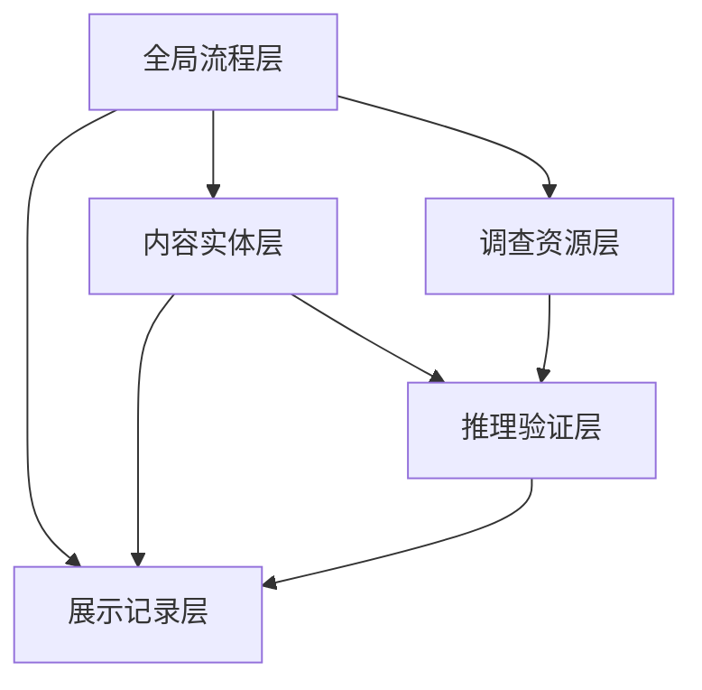

# 《暗线调查》核心数据结构设计

## 1. 文档目标

本文件定义新版《暗线调查》的核心状态模型、实体对象、页面数据输入输出、模块边界和首版实现建议。

设计目标：

1. 让“调查模拟 + 证据拼图 + 对话博弈”有稳定的数据基础
2. 避免实现阶段再次退回为“几个数值变量 + 五个按钮”
3. 支持首版单文件原型，也支持后续拆分成正式工程

本轮修订新增四条硬性要求：

4. 数据结构必须支持“主线明确、一步一步推进”的叙事表达
5. 数据结构必须支持“每天只有一个主行动”的页面引导
6. 首版模型必须控制复杂度，避免内容实体多于玩家实际能理解的量
7. 非行动区域以正文叙事为主，不再依赖信息卡组件

## 2. 总体架构思路

新版的数据结构建议分为五层：

1. 全局流程层
2. 调查资源层
3. 内容实体层
4. 推理验证层
5. 展示记录层



## 3. 全局状态模型

## 3.1 全局游戏状态

```ts
interface GameState {
  meta: MetaState;
  resources: ResourceState;
  caseProgress: CaseProgressState;
  world: WorldState;
  evidence: EvidenceState;
  dialogue: DialogueState;
  records: RecordState;
  guidance: GuidanceState;
  ui: UIState;
}
```

## 3.2 MetaState

负责整局流程与存档基础信息。

```ts
interface MetaState {
  saveVersion: string;
  runId: string;
  startedAt: number;
  updatedAt: number;
  currentDay: number;
  currentTimeSlot: TimeSlot;
  gamePhase: GamePhase;
  isEnded: boolean;
  endingId?: EndingId;
}

type TimeSlot = "morning" | "afternoon" | "night";

type GamePhase =
  | "briefing"
  | "investigation"
  | "dayEnd"
  | "ending";
```

## 3.3 ResourceState

四项后台资源统一放入资源层。

```ts
interface ResourceState {
  actionPoints: number;
  maxActionPoints: number;
  risk: number;
  pressure: number;
  credibility: number;
  fatigue: number;
}
```

字段说明：

- `actionPoints`：当前时段剩余行动点
- `risk`：风声是否外泄
- `pressure`：内外部阻力累积程度
- `credibility`：玩家当前推动支援、施压约谈的可信程度
- `fatigue`：是否需要保留精力，供后续扩展使用

首版可先用前四项，`fatigue` 先保留接口。

## 3.4 GuidanceState

为解决“玩家不知道现在要做什么”的问题，新增专门的引导层。

```ts
interface GuidanceState {
  storyStageId: StoryStageId;
  yesterdaySummary: string;
  todayGoal: string;
  currentSuspenseLine: string;
  mainActionId?: string;
  latestOutcome?: LatestOutcome;
  narrativeBlocks: NarrativeBlock[];
}

type StoryStageId =
  | "find_abnormality"
  | "trace_platform_role"
  | "lock_real_controller";

interface LatestOutcome {
  title: string;
  summary: string;
  nextHint: string;
}

interface NarrativeBlock {
  id: string;
  kind: "recap" | "suspicion" | "transition" | "ending";
  text: string;
}
```

这层的作用是：

- 告诉玩家昨天确认了什么
- 告诉玩家今天要查什么
- 告诉玩家今天的悬念是什么
- 告诉玩家现在唯一要点哪个按钮
- 告诉玩家刚才那一步带来了什么结果

## 4. 案件推进模型

## 4.1 CaseProgressState

负责主命题完成度、当日任务和章节进度。

```ts
interface CaseProgressState {
  currentObjectiveId: string;
  objectiveQueue: string[];
  hypotheses: HypothesisState[];
  unlockedSceneIds: string[];
  unlockedNpcIds: string[];
  unlockedFeatureIds: FeatureId[];
  currentMainQuestion: string;
  completedQuestionIds: string[];
}

type FeatureId =
  | "evidence_board"
  | "dialogue_room"
  | "character_file"
  | "case_summary";
```

## 4.2 主命题模型

```ts
interface HypothesisState {
  id: HypothesisId;
  title: string;
  status: HypothesisStatus;
  slotStates: EvidenceSlotState[];
  confidence: number;
  unlockedBy: string[];
}

type HypothesisId =
  | "approval_interference"
  | "platform_proxy"
  | "actual_control";

type HypothesisStatus =
  | "locked"
  | "available"
  | "partial"
  | "validated";

interface EvidenceSlotState {
  id: string;
  slotType: EvidenceSlotType;
  acceptedCardIds: string[];
  required: boolean;
  status: "empty" | "filled" | "conflicted";
}

type EvidenceSlotType =
  | "document"
  | "flow_or_relation"
  | "human_or_timeline";
```

这套结构的意义是：

- 玩家不是堆“证据值”
- 而是在给命题槽位填入不同类型的证据

但在首版展示中，这套命题结构必须被翻译成更简单的话，例如：

- “审批有没有被动过”
- “平台是不是在替别人出面”
- “谁才是真正拍板的人”

## 5. 世界内容实体

## 5.1 WorldState

负责场景、人物、事件和时间开放条件。

```ts
interface WorldState {
  scenes: SceneState[];
  npcs: NpcState[];
  eventFlags: Record<string, boolean>;
  dailySituation: DailySituationState;
  availableActions: ActionOption[];
}
```

## 5.2 场景模型

```ts
interface SceneState {
  id: string;
  name: string;
  description: string;
  dayAvailability: number[];
  timeAvailability: TimeSlot[];
  status: SceneStatus;
  riskLevel: number;
  hotspotIds: string[];
  entryCost: number;
  gateConditions: ConditionSet;
  mainQuestion: string;
  expectedOutcome: string;
}

type SceneStatus =
  | "locked"
  | "available"
  | "exhausted"
  | "disabled";
```

字段说明：

- `available`：当前可进入
- `exhausted`：今天已探索完
- `disabled`：因剧情或反制被关闭

新增字段说明：

- `mainQuestion`：这个场景是用来回答什么问题的
- `expectedOutcome`：玩家完成后应该拿到什么清晰结论

## 5.3 场景热点模型

```ts
interface Hotspot {
  id: string;
  sceneId: string;
  name: string;
  hotspotType: HotspotType;
  interactionState: "hidden" | "visible" | "resolved";
  rewardEvidenceIds: string[];
  triggerDialogueId?: string;
  puzzleId?: string;
  conditions: ConditionSet;
  isPrimary: boolean;
  resultSummary: string;
}

type HotspotType =
  | "document"
  | "timeline"
  | "conversation_trigger";
```

首版规则：

- 一个场景最多 2 个热点
- 其中必须有且只有 1 个 `isPrimary: true`
- 玩家处理完主热点后，系统必须能用一句话总结结果

这样可以避免页面出现大量不明所以的交互点。

## 5.3 补充：行动入口模型

为了让主控台维持线性推进，行动入口结构只保留“唯一主行动”和“辅助工具入口”。

```ts
interface ActionOption {
  id: string;
  label: string;
  actionType: ActionType;
  targetId?: string;
  priority: "primary" | "utility";
  cost: number;
  intentText: string;
  resultPreviewText: string;
  isEnabled: boolean;
  lockReason?: string;
}

type ActionType =
  | "go_scene"
  | "talk_npc"
  | "open_board"
  | "request_support"
  | "open_file";
```

字段说明：

- `priority`：决定它在 UI 中是唯一主按钮还是辅助入口
- `intentText`：告诉玩家“这一步是为了什么”
- `resultPreviewText`：告诉玩家“做完大概会得到什么”

这是这一轮最重要的结构之一，因为它直接决定主控台是否仍然保持线性叙事。

## 5.4 人物模型

```ts
interface NpcState {
  id: string;
  name: string;
  role: string;
  publicIdentity: string;
  hiddenTags: string[];
  trustLevel: number;
  alertLevel: number;
  stance: NpcStance;
  talkAvailability: boolean;
  relatedEvidenceIds: string[];
  relatedSceneIds: string[];
  unlockHint?: string;
  breakthroughSummary?: string;
}

type NpcStance = "defensive" | "probing" | "shaken" | "broken";
```

人物状态直接影响对话系统，而不是用独立随机数硬判定。

## 6. 证据系统模型

## 6.1 EvidenceState

```ts
interface EvidenceState {
  ownedCards: EvidenceCard[];
  boardAssignments: BoardAssignment[];
  discoveredCardIds: string[];
  unlockedEvidenceGroups: string[];
}
```

## 6.2 证据卡模型

```ts
interface EvidenceCard {
  id: string;
  title: string;
  category: EvidenceCategory;
  sourceType: EvidenceSourceType;
  sourceId: string;
  credibility: number;
  targetIds: string[];
  relatedHypothesisIds: HypothesisId[];
  keywords: string[];
  details: EvidenceDetailBlock[];
  contradictionsWith?: string[];
  effects?: EvidenceEffect[];
  isKeyEvidence: boolean;
  plainMeaning: string;
}


新增 `plainMeaning` 的目的，是把专业证据翻译成玩家一眼能懂的话。

例如：

- 证据名：`审批页改动痕迹`
- `plainMeaning`：`这能说明有人改过审批意见`

这样页面文案就不必总是堆原始材料名称。
type EvidenceCategory =
  | "document"
  | "fund"
  | "testimony"
  | "timeline"
  | "relation";

type EvidenceSourceType =
  | "scene"
  | "dialogue"
  | "event"
  | "support";
```

## 6.3 证据详情块

为了支持“点开查看细节”和“找改动”，证据详情不要只是一段长文，而是结构化内容。

```ts
interface EvidenceDetailBlock {
  id: string;
  blockType: "text" | "quote" | "highlight" | "image_region" | "diff_hint";
  label?: string;
  content: string;
}
```

例如一张审批页证据可以带多个 `highlight`：

- 原意见字段
- 修改后意见字段
- 签批时间
- 异常签字位置

## 6.4 证据板放置关系

```ts
interface BoardAssignment {
  hypothesisId: HypothesisId;
  slotId: string;
  evidenceCardId: string;
  assignmentStatus: "valid" | "weak" | "conflict";
}
```

这允许系统即时计算：

- 哪个命题已满足
- 哪个槽位还缺卡
- 哪些证据互相打架

## 7. 对话系统模型

## 7.1 DialogueState

```ts
interface DialogueState {
  activeDialogueId?: string;
  activeNpcId?: string;
  remainingSteps: number;
  shownEvidenceIds: string[];
  branchHistory: string[];
  dialogueResult?: DialogueResult;
  currentIntentText?: string;
}

type DialogueResult =
  | "neutral"
  | "gain_hint"
  | "gain_evidence"
  | "increase_alert"
  | "breakthrough";
```

## 7.2 对话节点模型

```ts
interface DialogueNode {
  id: string;
  npcId: string;
  text: string;
  choices: DialogueChoice[];
  enterConditions: ConditionSet;
}

interface DialogueChoice {
  id: string;
  label: string;
  choiceType: DialogueChoiceType;
  requiredEvidenceIds?: string[];
  effects: GameEffect[];
  nextNodeId?: string;
  intentText: string;
  outcomeHintText: string;
}


新增字段说明：

- `intentText`：这个选项是在试探、施压还是摊牌
- `outcomeHintText`：可能带来的后果，用一句简单人话表达

这样玩家在对话时不需要先理解系统，再决定怎么选。
type DialogueChoiceType =
  | "probe"
  | "present_evidence"
  | "press"
  | "withdraw";
```

## 7.3 对话效果模型

```ts
type GameEffect =
  | { type: "resource"; key: keyof ResourceState; delta: number }
  | { type: "npc_stance"; npcId: string; stance: NpcStance }
  | { type: "unlock_evidence"; evidenceCardId: string }
  | { type: "unlock_scene"; sceneId: string }
  | { type: "event_flag"; flag: string; value: boolean }
  | { type: "dialogue_result"; value: DialogueResult };
```

这样对话系统就能脱离硬编码文本，支持后续扩充。

## 8. 谜题系统模型

首版三类谜题都应该走统一接口。

```ts
interface PuzzleState {
  id: string;
  puzzleType: PuzzleType;
  status: "locked" | "available" | "solved" | "failed";
  attempts: number;
  maxAttempts: number;
  rewardEvidenceIds: string[];
  failEffects: GameEffect[];
}

type PuzzleType =
  | "document_diff"
  | "fund_route"
  | "statement_conflict";
```

但首版不强求三类谜题全部同时铺开，数据模型允许只启用 2 类。

每个谜题对象还应补充：

```ts
interface PuzzlePresentation {
  introText: string;
  successText: string;
  failText: string;
}
```

因为当前体验中的一个问题是：玩家做完谜题后，系统没有立刻用简单语言告诉他“这一步意味着什么”。

具体谜题数据可再拆分：

```ts
interface DocumentDiffPuzzleData {
  originalText: string;
  editedText: string;
  answerKeys: string[];
}

interface FundRoutePuzzleData {
  nodes: RouteNode[];
  validPaths: string[][];
}

interface StatementConflictPuzzleData {
  statements: string[];
  contradictionPairs: [number, number][];
}
```

## 9. 事件与反制模型

## 9.1 事件模型

```ts
interface WorldEvent {
  id: string;
  title: string;
  triggerConditions: ConditionSet;
  priority: number;
  onceOnly: boolean;
  effects: GameEffect[];
  description: string;
}
```

## 9.2 反制模型

反制本质上也是事件，但建议单独分类，便于调参。

```ts
interface CounterAction {
  id: string;
  name: string;
  triggerConditions: ConditionSet;
  severity: number;
  effects: GameEffect[];
}
```

示例反制：

- 统一口径
- 材料转移
- 取消会面
- 场景封闭

## 10. 条件系统

大量内容都依赖“是否满足前置条件”，因此建议抽象一个统一条件结构。

```ts
interface ConditionSet {
  mode: "all" | "any";
  items: ConditionItem[];
}

type ConditionItem =
  | { type: "day_at_least"; value: number }
  | { type: "time_slot"; value: TimeSlot }
  | { type: "resource_at_least"; key: keyof ResourceState; value: number }
  | { type: "resource_at_most"; key: keyof ResourceState; value: number }
  | { type: "has_evidence"; evidenceCardId: string }
  | { type: "has_feature"; featureId: FeatureId }
  | { type: "npc_unlocked"; npcId: string }
  | { type: "scene_unlocked"; sceneId: string }
  | { type: "event_flag"; flag: string; value: boolean }
  | { type: "hypothesis_status"; hypothesisId: HypothesisId; value: HypothesisStatus };
```

有了这套结构后：

- 场景开放
- 对话节点进入
- 事件触发
- 结局判断

都可以复用同一套规则。

## 11. 记录与日志模型

## 11.1 RecordState

```ts
interface RecordState {
  activityLogs: ActivityLog[];
  dayReports: DayReport[];
  unlockedEndingIds: EndingId[];
  storyBeats: StoryBeat[];
}

interface ActivityLog {
  id: string;
  day: number;
  timeSlot: TimeSlot;
  type: ActivityLogType;
  text: string;
  relatedIds?: string[];
  createdAt: number;
}

type ActivityLogType =
  | "scene"
  | "evidence"
  | "dialogue"
  | "event"
  | "counter_action"
  | "hypothesis";

interface StoryBeat {
  id: string;
  stageId: StoryStageId;
  title: string;
  summary: string;
}
```

日志的作用：

- 玩家复盘
- 结局页总结
- 后续 debug

其中：

- `activityLogs` 更偏系统记录
- `storyBeats` 更偏剧情推进摘要

后续页面展示时，优先显示 `storyBeats`，不要把系统日志原样堆给玩家。

## 12. UI 状态模型

虽然 UI 不是业务核心，但应避免把页面临时状态混进业务状态。

```ts
interface UIState {
  activePage: PageId;
  activeSceneId?: string;
  activeNpcId?: string;
  selectedEvidenceCardId?: string;
  openedModalIds: string[];
  highlightedHotspotId?: string;
  emphasizedActionId?: string;
  bodyPresentationMode?: "narrative";
}


新增字段说明：

- `emphasizedActionId`：当前主控台重点高亮的那个操作
- `bodyPresentationMode`：正文区域默认使用叙事排版，而不是卡片排版

这是为“正文叙事和行动按钮要明显不同”服务的 UI 数据基础。
type PageId =
  | "briefing"
  | "hub"
  | "scene"
  | "board"
  | "dialogue"
  | "character_file"
  | "case_summary"
  | "ending";
```

## 13. 结局判定模型

结局不应再只看单一证据值。

```ts
type EndingId =
  | "ending_a_complete"
  | "ending_b_incomplete"
  | "ending_c_exposed"
  | "ending_d_blocked"
  | "ending_e_barely_done";

interface EndingRule {
  id: EndingId;
  priority: number;
  conditions: ConditionSet;
  title: string;
  summary: string;
}
```

建议核心判定条件由以下几类组合而成：

- 三条命题完成数
- 关键证据是否具备
- 关键 NPC 是否突破
- 风险是否失控
- 压力是否爆表

## 14. 首版最小数据集建议

为了做出可玩的纵切版本，首版数据规模建议控制在：

- 5 天
- 4 个场景
- 4 个核心 NPC
- 12 到 16 张证据卡
- 3 条主命题
- 2 到 3 类谜题
- 6 到 10 个关键事件 / 反制
- 每天 1 个主行动

## 15. 首版模块划分建议

即使当前仍可能先做单文件原型，也建议按模块思维组织代码。

建议拆分为：

1. `game-state`
2. `resources`
3. `scenes`
4. `evidence`
5. `hypotheses`
6. `dialogues`
7. `guidance`
8. `puzzles`
9. `events`
10. `ending`
11. `ui-router`

## 16. 单文件原型与正式工程的兼容策略

如果先做单文件版，可在逻辑上仍按下面对象分层：

```ts
const store = {
  meta,
  resources,
  caseProgress,
  world,
  evidence,
  dialogue,
  records,
  guidance,
  ui
};
```

后续拆工程时，再把这些模块迁移出去，不改核心模型。

## 17. 实现优先级建议

数据结构落地时建议优先实现以下顺序：

1. `GameState`
2. `GuidanceState`
3. `ActionOption`
4. `SceneState`
5. `EvidenceCard`
6. `HypothesisState`
7. `BoardAssignment`
8. `DialogueNode`
9. `WorldEvent`
10. `EndingRule`

原因是：

- 引导层和行动入口先决定玩家能不能看懂主控台
- 场景、证据、命题板构成新版最核心的“互动性”
- 对话和事件建立中段深度
- 结局规则最后收束即可

## 18. 数据结构设计结论

这套模型的核心目的是把游戏从：

- “选择一个按钮，改几个数字”

变成：

- “阅读主线，执行唯一行动，获得新发现，继续推进剧情”

只要后续实现严格围绕这些实体展开，就能保证新版不会再退化成一个只有数值表演的页面壳。
