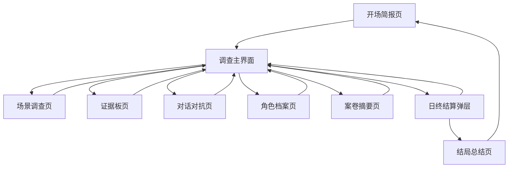
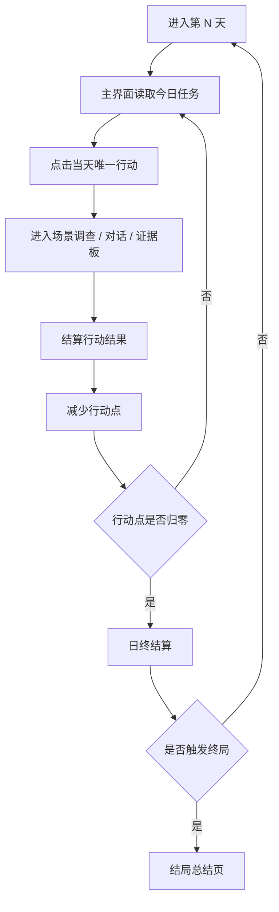

# 《暗线调查》页面流程设计

## 1. 文档目标

本文件定义新版《暗线调查》的页面结构、页面职责、跳转关系和关键交互节奏。

这份文档主要解决四个问题：

1. 玩家进入游戏后第一眼看到什么
2. 玩家如何从“接任务”进入“做调查”
3. 玩家在不同玩法页面之间如何切换
4. 页面如何保证沉浸感，而不是再次退回“数值面板 + 五个按钮”

本轮修订新增三个核心目标：

5. 页面要让玩家一眼分清“这是信息”还是“这是按钮”
6. 页面要让玩家始终知道“现在最该做什么”
7. 首版主界面不提供行动分支，只提供当天唯一行动

## 2. 总体页面结构

新版建议采用 `1 个开场入口 + 1 个调查主循环页 + 3 个核心玩法页 + 2 个辅助页面 + 1 个结局页` 的结构。

但在首版实现中，必须遵守“线性入口”原则：

- 主控台同时只突出 1 个主入口
- 不再提供同级次入口
- 辅助页不做成与主入口同等视觉权重

页面清单如下：

1. 开场简报页
2. 调查主界面
3. 场景调查页
4. 证据板页
5. 对话对抗页
6. 角色档案页
7. 案卷摘要页
8. 结局总结页

## 3. 页面流程总览

## 4. 页面详细设计

## 4.1 开场简报页

### 页面目标

- 给玩家一个世界内的进入点
- 建立案件氛围
- 提供开始游戏和继续进度的入口
- 不出现任何“设计说明感”文本

### 页面内容

- 游戏标题
- 任务编号
- 一段更完整的案件背景
- 一段你的任务说明
- “开始调查”
- “继续调查”
- “查看案卷摘要”入口

### 页面文案方向

示例语气：

“你临时接手了一份被搁置的项目材料。表面上只是几笔普通项目审批，但复核时发现，审批意见、平台往来和后续资金去向彼此对不上。你只有 5 天时间查清三件事：这件事是不是被人动过手脚，平台公司为什么总在关键节点出现，最后是谁一直躲在后面拍板。”

### 交互规则

- 点击 `开始调查`：进入 `调查主界面`
- 点击 `继续调查`：读取本地存档并进入 `调查主界面`
- 点击 `查看案卷摘要`：打开 `案卷摘要页` 或弹层

### 设计要求

- 不出现“目标”“约束”“脱敏说明”
- 背景信息必须写成案件简报口吻
- 开场信息控制在一屏内，避免冗长
- 玩家看完必须立刻知道自己是在查什么

## 4.2 调查主界面

### 页面目标

这是游戏的核心枢纽页，承担以下职责：

- 显示当前调查日与局势
- 明确告诉玩家当前主任务
- 只突出少量可执行行动
- 作为进入其他玩法页的中转站
- 提供最近获得线索和下一步建议

### 页面结构

建议拆为四个区域：

1. 顶部固定主线区
2. 页面主体叙事区
3. 唯一行动区
4. 辅助入口区

### 顶部固定主线区

内容包括：

- 今天的核心悬念
  或
- 刚刚确认的最新发现

这一块要始终固定在顶部，承担整页的叙事锚点作用。

这里是正文叙事，不是卡片，不是按钮，也不是数值面板。

### 页面主体叙事区

主体叙事区不再使用多张信息卡，而是直接在页面正文里顺序写出三段内容：

1. 昨天或刚才确认了什么
2. 现在最怀疑什么
3. 下一步为什么要去当前地点

这三段内容要更像阅读剧情正文，而不是查看仪表盘。

### 行动入口区

行动入口区只保留一个大按钮。

以按钮形式展示当前可进入的内容：

- 前往场景
- 约谈人物
- 打开证据板

每个按钮应明确显示：

- 名称
- 这一步是为了查什么
- 做完可能得到什么

按钮文案示例：

- `先去档案室：确认审批页到底哪里被改过`
- `去见经办人：确认明面上的人是不是只负责出面`
- `整理证据：把这一段线索补成完整判断`

行动区是全页唯一带“点击感”的主要区域。

### 辅助入口区

辅助入口退到页面边缘，以文字链接、抽屉入口或弱化按钮存在：

- 证据清单
- 角色档案
- 案卷摘要
- 关系图

### 视觉区分要求

主控台的视觉层级必须强制区分：

- 正文叙事区：纯文本排版，不做卡片
- 主按钮：高亮底色、明显边框、带箭头或图标
- 辅助入口：文字链接或弱化按钮，不能抢主线注意力

## 4.3 场景调查页

### 页面目标

让玩家真正“进入现场”，通过阅读、查看、答题、对话推进剧情。

但首版必须简化为“少点几次，每次都点得明白”，并且始终服务线性叙事。

### 页面结构

建议分为三部分：

1. 场景标题与导语
2. 核心调查对象区
3. 行动结果区

### 核心调查对象区

一个场景内不再散放多个看不懂的热点，而是只保留 1 到 2 个清晰调查对象，例如：

- 审批页
- 登记本
- 流水路径
- 补充协议
- 聊天记录
- 夜间碰面记录

玩家点击后只会触发三类结果：

- 文档查看
- 证据收集
- 谜题进入

如果场景需要人物出现，也应作为剧情结果出现，而不是和热点并排出现。

### 行动结果区

展示：

- 你刚刚看到了什么
- 你因此确认了什么
- 这一发现会把故事推向哪里
- 返回按钮

### 页面跳转

- 谜题型热点 -> 进入局部弹层谜题
- 处理完成 -> 弹出简短结果反馈
- 收集结束 -> 返回 `调查主界面`

## 4.4 证据板页

### 页面目标

这是整个游戏最重要的逻辑页，用来完成“证据拼接”和“命题验证”。

### 页面结构

建议为三段布局：

1. 顶部说明
2. 证据卡列表
3. 命题板与反馈

### 顶部说明

先用一句最直白的话说明当前目的，例如：

- “现在先证明审批是不是被人改过。”
- “现在要补齐平台只是出面的证据。”

### 证据卡列表

证据卡需要支持：

- 数量控制
- 点击查看详情
- 选择后放入命题槽位

首版不做复杂筛选，避免玩家又进入“证据很多但不知道用哪张”的状态。

首版原则：

- 当前页只突出 3 到 5 张最相关证据
- 其它证据折叠到“更多材料”里

### 命题板与反馈

固定三条主命题：

1. 审批干预
2. 平台代持
3. 实际控制

每条命题下有多个槽位：

- 文件槽
- 流水 / 关系槽
- 人证 / 时序槽

当玩家放入证据时，系统应立即反馈：

- 有效
- 证据不足
- 逻辑矛盾
- 可触发新推论

反馈文案必须说人话，不写系统术语。

示例：

- “这张材料能证明平台出现过，但还不能证明它是在替别人出面。”
- “你已经能去见项目经办人了，他可能会松口。”

### 页面跳转

- 点击证据详情 -> 打开证据详情弹层
- 点击可约谈人物提示 -> 可跳到 `对话对抗页`
- 点击返回 -> 回到 `调查主界面`

## 4.5 对话对抗页

### 页面目标

让玩家通过关键对话推进调查，而不是依赖大量分支。

### 页面结构

建议分为四块：

1. NPC 信息区
2. 当前对话区
3. 已出示证据区
4. 可选发言区

### NPC 信息区

显示：

- 角色名
- 当前立场状态
- 警觉倾向
- 你对其掌握程度

### 当前对话区

显示：

- NPC 当前发言
- 场景氛围描述
- 本轮结果反馈

### 已出示证据区

显示本轮已经出示的证据，避免玩家遗忘。

### 可选发言区

每次对话给出 2 到 3 个操作：

- 试探发问
- 出示证据
- 追问关键矛盾

每轮约谈最多 3 步，但它本质上是线性剧情中的一个关键互动段落。

但在首版页面上，优先做成更简单的形式：

- 每次只显示 2 到 3 个按钮
- 每个按钮标题都写明意图
- 每个按钮下方都写一句后果提示

### 页面跳转

- 对话结束 -> 返回 `调查主界面`
- 触发新线索 -> 自动加入证据库
- 触发失控 -> 写入高风险事件并返回主界面

## 4.6 角色档案页

### 页面目标

帮助玩家整理案件人物关系，而不是替代证据板。

### 页面内容

- 角色列表
- 每个角色的已知身份
- 与哪些公司或项目有联系
- 与哪些证据相关
- 当前可否约谈

### 页面作用

- 帮助玩家复盘
- 降低中后期信息负担
- 为选择下一个调查对象提供依据

## 4.7 案卷摘要页

### 页面目标

承担世界内化的“说明书”作用。

### 页面内容

全部写成案卷语气，包括：

- 案件背景
- 当前已知异常
- 调查期限
- 注意事项
- 移交备注

### 不能出现的写法

- “本游戏玩法是……”
- “你需要通过……获胜”
- “风险条表示……”

### 推荐表达

- “目前仅确认表层异常，尚未形成闭环指控”
- “相关材料可能随时发生转移，请谨慎惊动关联方”

## 4.8 结局总结页

### 页面目标

对本局调查结果做世界内总结，同时让玩家清楚自己差在哪里。

### 页面结构

建议包括：

1. 结局标题
2. 案件总结
3. 命题完成情况
4. 关键转折复盘
5. 重新开始

### 页面内容

- 哪三条命题完成了几条
- 哪个关键证据缺失
- 哪个关键人物未突破
- 风险或压力在哪一天失控

### 设计要求

- 必须有复盘价值
- 玩家看完要知道“下次怎么打得更好”

## 5. 页面状态切换规则

## 5.1 主循环状态

主循环按以下节奏运行：

## 5.2 页面解锁规则

- `证据板页`：按剧情节奏开放，不必首日强行出现
- `对话对抗页`：首次遇到关键人物后开放
- `角色档案页`：获得首张人物相关证据后开放
- 特定场景：按日期和前置证据开放

首版不强调复杂时段切换，避免玩家分心。

## 6. 首版页面最小集合

为了优先做出可玩的纵切版本，第一阶段可以先只实现以下页面：

1. 开场简报页
2. 调查主界面
3. 一个场景调查页
4. 一个证据板页
5. 一个对话对抗页
6. 一个结局总结页

角色档案页和案卷摘要页可以先做成弹层，而不是独立大页。

## 7. 首版页面开发顺序建议

建议按如下顺序落地：

1. 开场简报页
2. 调查主界面
3. 场景调查页原型
4. 证据板页原型
5. 对话对抗页原型
6. 日终结算与结局页

原因是：

- 主界面能先跑通状态流转
- 场景页和证据板页先建立“游戏性”
- 对话页再补足中段深度
- 最后再补日终和结局收束

补充要求：

- 开发时先做“主线一眼可懂”
- 再做“正文叙事和按钮彻底分开”
- 最后再补视觉层次和氛围细节

## 8. 页面设计结论

这套页面流程的目标是把玩家感知从：

- “我在玩一个点击数值面板”

转成：

- “我在一线做一件需要判断、调查、拼证据、控制节奏的事”

后续进入实现时，所有页面都必须遵守一个原则：

- 页面表达案件，不表达产品设计
